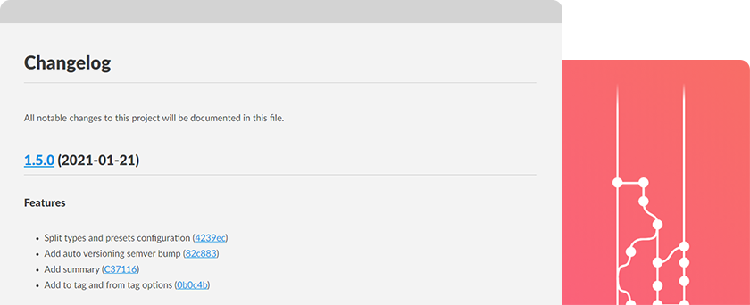

<div align="center">

<h1 align="center">PHP Conventional Changelog</h1>


[](https://conventionalcommits.org)

[](https://github.com/marcocesarato/php-conventional-changelog)

#### If this project helped you out, please support us with a star :star:

<br>



</div>

## Description

When a new release of a software project is announced, it is convenient to generate documents that let the project 
users know what were the changes and other relevant notes about the new project release.

This package can help to automatically generate changelog and release note files, so the developers of the project 
reduce the work that is necessary to finalize and check the new release of the project.

This package can generate a changelog from a project's committing history messages and metadata using composer and automate versioning
with [**semver**](https://semver.org) and [**conventional-commits**](https://conventionalcommits.org).

It provides a command that can be run from the terminal, or using composer scripts, 
to generate a changelog file in **markdown** for the current project.

The command may take parameters that define the releases of the project that will be considered to extract the changes
from the git history to generate the file. The package uses a configuration system with that permit to customize the
settings you may want to have your desired changelog generated.

Look at our [CHANGELOG](CHANGELOG.md) file if you are looking for an example of a possible final result.

### How to contribute

Have an idea? Found a bug? Please raise to [ISSUES](https://github.com/marcocesarato/php-conventional-changelog/issues)
or [PULL REQUEST](https://github.com/marcocesarato/php-conventional-changelog/pulls). Contributions are welcome and are
greatly appreciated! Every little bit helps.

## 📘 Requirements
- [php](https://www.php.net) >= 7.1.3
- [git](https://git-scm.com) >= 2.1.4

## 📖 Installation

You can install it easily with composer

`composer require --dev marcocesarato/php-conventional-changelog`

#### Scripts *(Optional)*

For easy use the changelog generator or release faster your new version you can add to your `composer.json` the scripts:

> **Notes:** you can customize it according to your needs

```
{
  ...
  "scripts": {
    "changelog": "conventional-changelog",
    "release": "conventional-changelog --commit",
    "release:patch": "conventional-changelog --patch --commit",
    "release:minor": "conventional-changelog --minor --commit",
    "release:major": "conventional-changelog --major --commit"
  },
  ...
}
```

Now you can just run `composer changelog` or `composer release` (the last one will autobump the version code and commit changes) to generate your changelog.

## 📘 Configuration

> **Notes:** this procedure is *optional* and permit to overwriting/merging the default settings

For customize settings you just needs to create a file named `.changelog` on the root of your project/on the working
dir or use the `--config` option to specify the location of your configuration file.

> **Notes:**<br>
> - When a setting on the configuration file is not necessary just omit it
> - The default ignored types are: `build`, `chore`, `ci`, `docs`, `perf`, `refactor`, `revert`, `style`, `test`
> - To allow all types just keep empty `types` and set empty `ignoreTypes`

You can have more info about reading the [config documentation](./docs/config.md).

## 💻 Usage

The changelog generator will generate a log of changes from the date of the last tag to the current date, and it will
put all commit logs in the latest version just created.


> **Notes:**<br>
> - Some of these options listed on examples could be used together at the same time (ex. `--first-release --commit`)
> - Auto bump of version code using the [Semantic Versioning](https://semver.org) (`MAJOR.MINOR.PATCH`) is enabled by default if not specified the release method.
>    - `MAJOR`: At least one breaking change.
>    - `MINOR`: At least one new feature.
>    - `PATCH`: Default
> - Use these options to specify the release method: `--major`, `--minor`, `--patch`, `--rc`, `--beta`, `--alpha`.

### Examples

#### First version

> **Notes:** use this option only if you don't need all history changes or is the first version, else run with `--history` option

To generate your changelog for the first version run:

```shell
php vendor/bin/conventional-changelog --first-release
```

#### New version

To generate your changelog *(without committing files)*

```shell
php vendor/bin/conventional-changelog
```

#### New release (with commit and tag)

To generate your changelog with auto commit and auto versioning tagging run:

```shell
php vendor/bin/conventional-changelog --commit
```

or to amend at an existing commit you can run:

```shell
php vendor/bin/conventional-changelog --amend
```

#### History

To generate your changelog with the entire history of changes of all releases

> **Warn:** this operation will overwrite the `CHANGELOG.md` file if it already exists

```shell
php vendor/bin/conventional-changelog --history
```

#### Date range

To generate your changelog from a specified date to another specified date

```shell
php vendor/bin/conventional-changelog --from-date="2020-12-01" --to-date="2021-01-01"
```

#### Tag range

To generate your changelog from a specified tag to another specified tag

```shell
php vendor/bin/conventional-changelog --from-tag="v1.0.2" --to-tag="1.0.4"
```

#### Specific version

To generate your changelog with a specific version code

```shell
php vendor/bin/conventional-changelog --ver="2.0.1"
```

### Commands List

> **Info:** You can have more info about running  `php vendor/bin/conventional-changelog --help`

```
Description:
  Generate changelogs and release notes from a project's commit messagesand metadata and automate versioning with semver.org and conventionalcommits.org

Usage:
  changelog [options] [--] [<path>]

Arguments:
  path                               Specify the path directory where generate changelog

Options:
      --config=CONFIG                Specify the configuration file path
  -c, --commit                       Commit the new release once changelog is generated
  -a, --amend                        Amend commit the new release once changelog is generated
      --commit-all                   Commit all changes the new release once changelog is generated
      --first-release                Run at first release (if --ver isn't specified version code it will be 1.0.0)
      --from-date=FROM-DATE          Get commits from specified date [YYYY-MM-DD]
      --to-date=TO-DATE              Get commits last tag date (or specified on --from-date) to specified date [YYYY-MM-DD]
      --from-tag=FROM-TAG            Get commits from specified tag
      --to-tag=TO-TAG                Get commits last tag (or specified on --from-tag) to specified tag
      --major                        Major release (important changes)
      --minor                        Minor release (add functionality)
      --patch                        Patch release (bug fixes) [default]
      --rc                           Release candidate
      --beta                         Beta release
      --alpha                        Alpha release
      --ver=VER                      Specify the next release version code (semver)
      --history                      Generate the entire history of changes of all releases
      --no-verify                    Bypasses the pre-commit and commit-msg hooks
      --no-tag                       Disable release auto tagging
      --no-change-without-commits    Do not apply change if no commits
      --annotate-tag[=ANNOTATE-TAG]  Make an unsigned, annotated tag object once changelog is generated [default: false]
      --merged                       Only include commits whose tips are reachable from HEAD
  -h, --help                         Display help for the given command. When no command is given display help for the changelog command
```